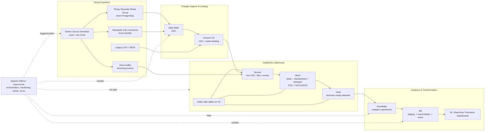

# Post-Merger Enterprise Data Platform Architecture

## Core Engineering Patterns

- CDC
- SCD Type 1
- SCD Type 2
- schema evolution
- deduplication
- late-arriving data
- data-quality gates
- replay/backfill
- idempotency
- medallion architecture
