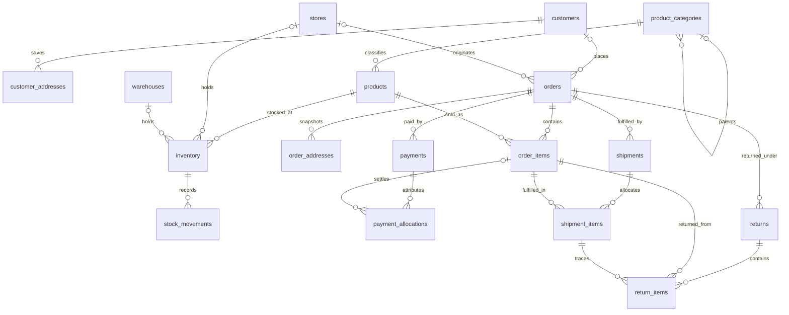

# Rocky Mountain Retail Group — proposed PostgreSQL source model

Status: **proposed Phase 1 contract, awaiting business/engineering agreement**. This is a design, not an assertion about an existing database. No DDL, database deployment, simulator, ingestion pipeline, or architecture change is included.

Rocky Mountain is the larger, mature omnichannel retailer: registered and guest customers, ecommerce and store orders, store pickup, warehouse/store fulfillment, split shipments, split tenders, partial returns, and stock transfers. PostgreSQL on Aiven remains the operational source; AWS DMS -> S3 remains the database CDC path.

## Reading order

1. [Conventions and enforcement](conventions.md): shared columns, types, keys, audit semantics, and enforcement boundaries.
2. [Customers and catalog](customers-and-catalog.md): customers, customer addresses, product categories, products.
3. [Locations and inventory](locations-and-inventory.md): stores, warehouses, inventory, stock movements.
4. [Orders and payments](orders-and-payments.md): orders, order addresses, order items, payments, payment allocations.
5. [Fulfillment and returns](fulfillment-and-returns.md): shipments, shipment items, returns, return items.
6. [CDC and analytical history](cdc-and-scd.md): complete capture scope, deletes, replay, and downstream analytical SCD candidates.
7. [Assumptions and decision review](assumptions-and-review.md): local decisions, unresolved approvals, validation scenarios, and review of existing documentation.

## Table inventory

All tables are proposed in the `rmrg` PostgreSQL schema. Every table has a single immutable `bigint` primary key, the common audit columns, and full-load plus insert/update/delete CDC participation. All foreign keys target this schema.

| Table | Grain | Primary key | Main relationships |
| --- | --- | --- | --- |
| customers | One customer account | customer_id | Has addresses and zero or more orders |
| customer_addresses | One saved address for a customer | customer_address_id | Belongs to customer |
| product_categories | One category node | category_id | Optional parent category; has products |
| products | One sellable SKU/variant | product_id | One primary category; referenced by stock and sales |
| stores | One retail location | store_id | Origin/pickup/fulfillment location |
| warehouses | One distribution location | warehouse_id | Fulfillment and stock location |
| inventory | One SKU at one store or warehouse | inventory_id | Product plus exactly one physical location |
| stock_movements | One signed stock ledger leg | stock_movement_id | Inventory; optional fulfillment/return line |
| orders | One commercial order | order_id | Optional customer and origin store; has lines, tenders, fulfillment, returns |
| order_addresses | One immutable billing/shipping address snapshot per order role | order_address_id | Order; optional saved-address provenance |
| order_items | One priced line on an order | order_item_id | Order and product |
| payments | One payment operation/attempt | payment_id | Order; optional prior operation and return |
| payment_allocations | One capture/refund allocation to a line or shipping component | payment_allocation_id | Payment, original order line/component, and exact return item for RMA line refunds |
| shipments | One fulfillment consignment or pickup handover | shipment_id | Order; exactly one origin store/warehouse |
| shipment_items | One order-line allocation in a consignment | shipment_item_id | Shipment and order item from same order |
| returns | One return authorization | return_id | Order; exactly one receiving store/warehouse |
| return_items | One returned allocation of a fulfilled order line | return_item_id | Return, order item, and shipment item from same order |

Supporting tables stay within the requested domains: `order_addresses` prevents customer edits from changing historical orders; `shipment_items` and `return_items` resolve line-level many-to-many allocations. `payment_allocations` attributes split-tender captures and partial refunds to original monetary components. They are not new business platforms or a warehouse dimensional model.

## Relationship overview

The diagram shows individual relationships; the exactly-one-location and same-order rules in the table contracts must also hold. An order can be empty only while draft; placement requires at least one line. No schema or contract for Stampede City Commerce is proposed here.
