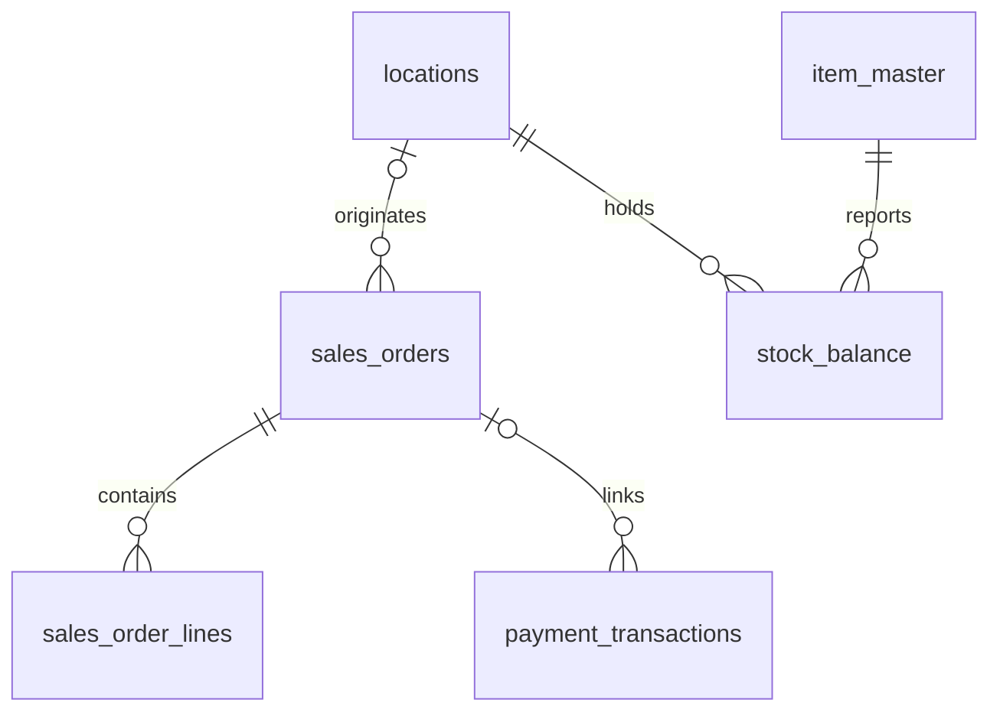

# Stampede City Commerce — proposed MySQL source model

Ticket: KAN-21, “Design Stampede City Commerce source schema.” Status: **proposed Phase 1 design for review**. This represents an intentionally older, smaller retail application hosted on Aiven MySQL, not a discovered production schema. Seven operational tables, not a copy of Rocky Mountain's 17-table model. No DDL, pipelines, architecture changes or changes to the approved Rocky Mountain model.

## Documents

- [Conventions](conventions.md): types, local clocks, weak audits and enforcement boundaries.
- [Table dictionary](tables.md): all columns, keys, nullability, indexes and source rules.
- [Legacy files](legacy-files.md): which data stays CSV/JSON, grain, proposed fields and authority.
- [Mappings and quality](mappings-and-quality.md): differences from Rocky Mountain and realistic quality cases.
- [CDC and SCD](cdc-and-scd.md): capture scope, replay/deletes and analytical history candidates.
- [Assumptions and review](assumptions-and-review.md): decisions, validation scenarios, unresolved questions and existing-doc review.

## Table inventory

Proposed MySQL database: `scc`. Every table has a non-null immutable numeric primary key, three shared legacy audit columns, and full-load + insert/update/delete CDC participation. Codes are business references, never substitutes for these source keys.

| Table | Intended grain | Primary key | Relationship style |
| --- | --- | --- | --- |
| customer_master | One customer/account card, not necessarily one real person | customer_id | Duplicate customer codes/person records allowed |
| item_master | One item record, not necessarily one unique enterprise SKU | item_id | Free-text department/UOM; duplicate item codes possible |
| sales_orders | One POS/back-office sales document | sales_order_id | Known location FK; loose customer account reference |
| sales_order_lines | One entered document line | sales_order_line_id | Enforced parent order FK; loose item reference |
| payment_transactions | One entered receipt/refund posting | payment_transaction_id | Optional enforced order FK; no authorization/capture graph |
| locations | One store or stockroom/depot | location_id | Unified location types, not separate store/warehouse tables |
| stock_balance | One reported item/location balance record | stock_balance_id | Enforced item/location FKs; duplicate balances are quality exceptions |

Customer references on orders and item references on lines are logical associations without database FKs; the diagram deliberately shows only enforced relationships. Not every document is linked to a real customer, and a raw item code may not resolve uniquely. [Quality rules](mappings-and-quality.md) address those cases without creating fake source records.

The source has no customer-address, category, stock-ledger, payment-allocation, shipment, or return tables. Addresses and category labels are denormalized; shipments/returns and historical archives remain files. No row_version, optimistic-lock contract, immutable commercial snapshots or universal business-request idempotency key is invented for this legacy application. Downstream processing must be restartable and reconcile these limitations.
